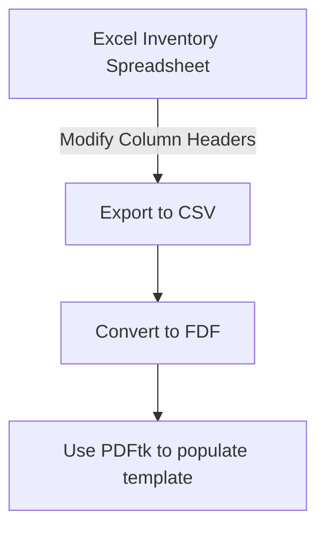

# Forms

This was a one-off, quick-and-dirty Python project I wrote during a week at an
internship.  The company had a few dozen items it had received from the U.S.
Navy over a decade prior which it was getting rid of, and for which there was
no documentation for the original issue.  Because the equipment had been
issued by the Navy, it had to be returned to the Navy, which meant a whole lot
of paperwork.

My time in the Army made me intimately familiar with military equipment turn-in
procedures, so I knew that this can be a tedious process with just a handful
of items.  The thought of generating all these forms "by hand" in quadruplicate
was just too tedious to bear, and introduced too many chances for transcription
errors.

# Python to the rescue!

The script [fdftest.py](fdftest.py) solved this problem. It accepts CSV input,
mapping the columns to the DoD Form 1348-1A which were required by the
DLA[^dla] Disposition Services Office we were turning this equipment into, and
produces filled-in copies of the form complete with scannable barcodes.

[^dla]: Defense Logistics Agency

# Things I learned

This was a custom-tailored script designed to do a single specific task, and
would take more effort than I feel it's worth to generalize into a broader
solution. It would require accounting for so many unknowns as to be
impractical.

However, this was a very rewarding project because it solved a problem with
100% accuracy that I knew from firsthand experience to be a PITA[^pita].

[^pita]: I'm sure you know what this means.

## Barcodes

Using a simple smartphone barcode scanner app, I determined that the style of
barcode used on the sample form sent to us by the DLA office.  As it turns out,
many barcodes can be reproduced in PDFs by simply setting the field font to one
of the many standard barcode fonts. All that's required after that is to supply
the plaintext corresponding to the decoded barcode, and the PDF software will
render the barcode properly.


## PDF/FDF file structure

I learned about the internal structure of a PDF file. PDFs are largely binary
data, but there is an intermediate format called Forms Data Format (FDF) which
stores the content of the forms in plaintext.  The general form is `<< /T (key)
/V (value) >>`. 

Once I learned how the file internals needed to be organized, writing the
script was very straightforward. The conversion to PDF was accomplished via a
system call to the [PDFtk tookit](https://www.pdflabs.com/tools/pdftk-the-pdf-toolkit/).

## Document number format

Each item turned in required its own form, and each form required a unique ID
number in a specific format, called a Document Number, which is the
concatenation of the following items:

- DODAAC: Department of Defense Activity Address Code. A six-digit alphanumeric
  code that identifies the unit to which the equipment belongs
- Julian date: a four-digit date of the form `Yddd`, where `Y` is the last
  digit of the current calendar year, and `ddd` is the day of the year on which
  the document was generated
- ID number: a four-digit arbitrary but unique positive integer. The only
  requirement is that no two documents can have the same ID number for a given
  Julian date.  Cannot be `0000`.

I wrote the following function to generate Document Numbers:

```python
# "constants" for PDF form
fdf_static_content = {
    'DODAAC_FROM': 'N00060',
    ...
}

# DOCNO stuff
id = 1
def getDocNo():
    day_of_year = str(datetime.today().timetuple().tm_yday)
    julian_year = str(datetime.today().timetuple().tm_year)[3:]
    
    global id
    docNo = fdf_static_content['DODAAC_FROM'] + julian_year + day_of_year + f'{id:0>{4}}'
    id += 1
    return docNo

```


# Flow



# Sketching the problem

```python
# populate n PDFs with data from a CSV file, n = num records in CSV file
    # read CSV
    # for each record in CSV
        # generate temp FDF
            # field mapping (see below)
        # populate PDF with FDF data
            # (system|subprocess).run(pdftk...)

```
