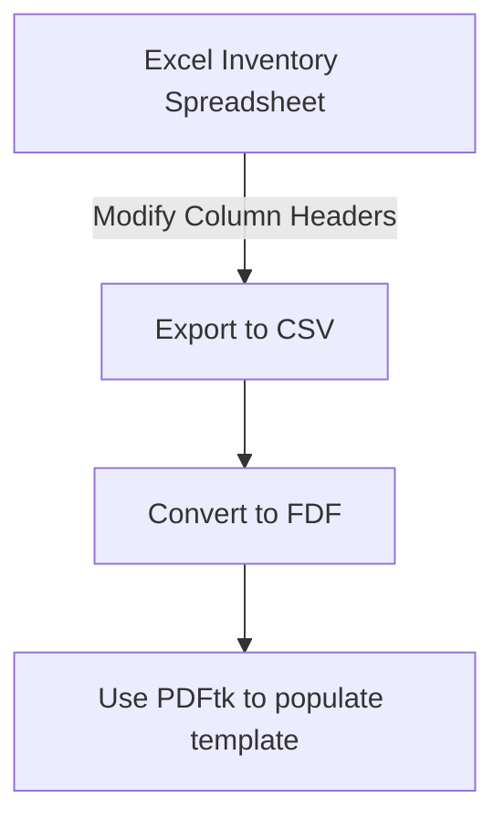

# Flow



# Sketching the problem

```python
# populate n PDFs with data from a CSV file, n = num records in CSV file
    # read CSV
    # for each record in CSV
        # generate temp FDF
            # field mapping (see below)
        # populate PDF with FDF data
            # (system|subprocess).run(pdftk...)

```

# field mapping
## Static data
